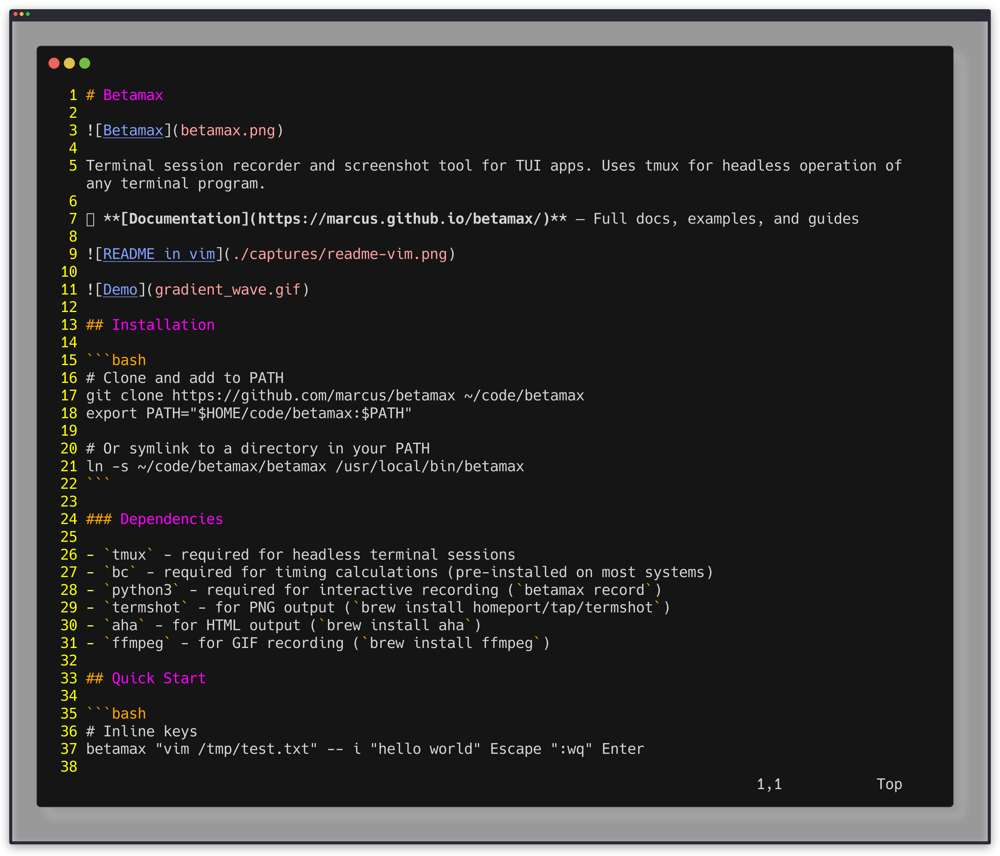
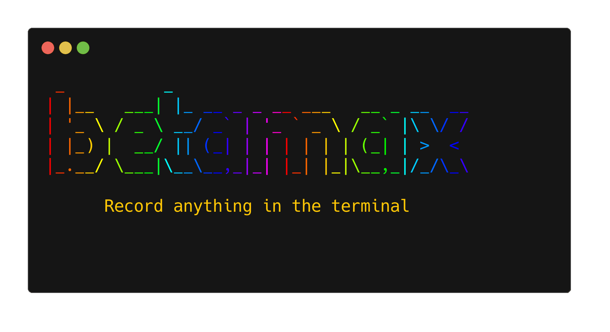

# Betamax


Terminal session recorder and screenshot tool for TUI apps. Uses tmux for headless operation of any terminal program.

📖 **[Documentation](https://marcus.github.io/betamax/)** — Full docs, examples, and guides





## Installation

```bash
# Clone and add to PATH
git clone https://github.com/marcus/betamax ~/code/betamax
export PATH="$HOME/code/betamax:$PATH"

# Or symlink to a directory in your PATH
ln -s ~/code/betamax/betamax /usr/local/bin/betamax
```

### Dependencies

- `tmux` - required for headless terminal sessions
- `bc` - required for timing calculations (pre-installed on most systems)
- `python3` - required for interactive recording (`betamax record`)
- `termshot` - for PNG output (`brew install homeport/tap/termshot`)
- `aha` - for HTML output (`brew install aha`)
- `ffmpeg` - for GIF recording (`brew install ffmpeg`)

## Quick Start

```bash
# Inline keys
betamax "vim /tmp/test.txt" -- i "hello world" Escape ":wq" Enter

# Keys file
betamax "myapp" -f capture-screenshot.keys

# Override decorations without editing the keys file
betamax "myapp" -f demo.keys --theme dracula --shadow --window-bar colorful
```

## Recording Sessions

Instead of writing `.keys` files manually, you can record your terminal session interactively:

```bash
# Record a vim session
betamax record -o demo.keys vim test.txt

# Record and generate GIF in one step
betamax record --gif demo.gif --auto-frame vim test.txt

# Record with manual frame marking (press Ctrl+G during recording)
betamax record --frame-key C-g -o demo.keys htop
```

During recording:
- **Ctrl+G** (or your custom `--frame-key`) marks a frame for GIF recording
- **Ctrl+D** or typing `exit` ends the recording
- All keystrokes are captured with timing information

The generated `.keys` file can be replayed with `betamax` to produce consistent GIF output.

### Recording Options

| Option | Description |
|--------|-------------|
| `-o, --output FILE` | Output .keys file (default: recording.keys) |
| `--gif FILE` | Also generate GIF after recording |
| `--auto-frame` | Add @frame after every keystroke |
| `--frame-key KEY` | Hotkey to mark frames (default: C-g) |
| `--delay MS` | Use fixed delay instead of measured timing |
| `--min-delay MS` | Minimum delay between keys (default: 50ms) |
| `--max-delay MS` | Maximum delay cap (default: 2000ms) |
| `--max-duration SEC` | Max recording duration (default: 300s = 5 min) |
| `--cols / --rows` | Terminal dimensions |

## Capturing Screenshots

Capture PNG screenshots of any TUI interactively with a hotkey:

```bash
# Basic capture - press Ctrl+G anytime to screenshot
betamax capture vim myfile.py

# With decorations
betamax capture --theme dracula --shadow --window-bar colorful htop

# Custom hotkey and output directory
betamax capture --key C-s --output-dir ./screenshots vim
```

Uses a transparent tmux session with `bind-key -n` to intercept the hotkey before it reaches your TUI. Works with vim, htop, or any terminal application.

### Configuration

Supports config files and presets to avoid repeating flags:

```bash
# .betamaxrc (project) or ~/.config/betamax/config (global)
preset=docs
theme=dracula
shadow=true
window-bar=colorful

# ~/.config/betamax/presets/docs.conf
theme=catppuccin-mocha
shadow=true
window-bar=colorful
border-radius=8
padding=10
```

Precedence: CLI flags > `@set:` directives > `.betamaxrc` > global config > preset > defaults.

### Capture Options

| Option | Description |
|--------|-------------|
| `--key KEY` | Capture hotkey (default: C-g / Ctrl+G) |
| `--output-dir DIR` | Output directory (default: ./captures) |
| `--preset NAME` | Load named preset from ~/.config/betamax/presets/ |
| `--save-text` | Also save raw ANSI text file alongside PNG |
| `--cols / --rows` | Terminal dimensions |
| `--theme NAME` | Color theme (dracula, nord, catppuccin-mocha, etc.) |
| `--window-bar STYLE` | Window bar: colorful, colorful_right, rings |
| `--shadow` | Enable drop shadow |
| `--border-radius N` | Rounded corners |
| `--padding N` / `--margin N` | Spacing |

## Output Formats

Betamax can capture terminal output in multiple formats:

| Format | Extension | Description | Dependency |
|--------|-----------|-------------|------------|
| **Text** | `.txt` | Raw text with ANSI color codes preserved | none |
| **HTML** | `.html` | Styled HTML with colors rendered | `aha` |
| **PNG** | `.png` | Screenshot image of terminal | `termshot` |
| **GIF** | `.gif` | Animated recording of terminal session | `termshot` + `ffmpeg` |

```bash
# Capture as PNG screenshot
betamax "htop" -- @sleep:1000 @capture:htop.png q

# Capture as HTML
betamax "ls --color" -- @capture:listing.html

# Capture all formats at once
betamax "neofetch" -- @sleep:500 @capture:system

# Record animated GIF
betamax "./my-tui-app" -f record.keys  # uses @record:start/@frame/@record:stop
```

## Troubleshooting

### Colors or background don't match your terminal

Betamax runs a headless tmux session and renders PNGs with termshot, so it does
not inherit your terminal app's (iTerm, Terminal.app, etc.) color profile.
`--theme` only affects window bar/margins/padding; terminal content colors come
from ANSI output and termshot's palette.

Tips:
- Ensure tmux advertises truecolor (24-bit) so apps render full RGB values.
  Add to `~/.tmux.conf`:

  ```tmux
  set -g default-terminal "tmux-256color"
  set -ga terminal-overrides ",*:Tc"
  ```

- If your app leaves the background as "default" (e.g. `Normal` has no `guibg`),
  set an explicit background color so it doesn't depend on the terminal default.
  In Neovim/LazyVim, check `:hi Normal` and override after the colorscheme loads:

  ```lua
  vim.api.nvim_create_autocmd("ColorScheme", {
    callback = function()
      local bg = "#1e1e2e"
      vim.api.nvim_set_hl(0, "Normal", { bg = bg })
      vim.api.nvim_set_hl(0, "NormalFloat", { bg = bg })
      vim.api.nvim_set_hl(0, "SignColumn", { bg = bg })
    end,
  })
  ```

## Usage

```
betamax [options] <command> -- <key1> <key2> ...
betamax [options] <command> -f <keys-file>
betamax record [options] <command>
betamax capture [options] [command]
```

### Options

| Option | Description |
|--------|-------------|
| `-s, --session NAME` | Session name (default: betamax) |
| `-d, --delay MS` | Delay between keys in ms (default: 500) |
| `-w, --wait PATTERN` | Wait for pattern before sending keys |
| `-t, --timeout SEC` | Timeout waiting for app (default: 30) |
| `-k, --keep` | Keep session alive after keys sent |
| `-c, --capture` | Capture and print final pane state |
| `-o, --output-dir DIR` | Output directory for captures (default: ./captures) |
| `-f, --keys-file FILE` | Read keys from file |
| `--cols COLS` | Terminal width (default: current terminal) |
| `--rows ROWS` | Terminal height (default: current terminal) |
| `--shell PATH` | Shell to use in tmux session |

## Keys File Format

Keys files are declarative scripts that define terminal interactions. Each line is either a directive, an action, or a key to send.

### Example

```bash
# capture-demo.keys

# Settings (VHS-inspired) - CLI flags override these
@set:cols:120
@set:rows:40
@set:delay:100
@set:output:./screenshots
@set:shell:/bin/bash
@require:termshot

# Keys and actions
@sleep:500                # Wait for app to start
Escape                    # Clear any input focus
@wait:Ready               # Wait for "Ready" text
j@50                      # Navigate down quickly (50ms delay)
j@50
j@50
Enter@300                 # Select item, wait 300ms
@capture:demo.png         # Take screenshot
q                         # Quit
y                         # Confirm
```

### Settings Directives

Settings at the top of a keys file make it self-describing and reproducible.

| Directive | Description |
|-----------|-------------|
| `@set:cols:N` | Terminal width (overridden by `--cols`) |
| `@set:rows:N` | Terminal height (overridden by `--rows`) |
| `@set:delay:MS` | Default delay between keys (overridden by `-d`) |
| `@set:output:DIR` | Output directory (overridden by `-o`) |
| `@set:timeout:SEC` | Wait timeout (overridden by `-t`) |
| `@set:shell:PATH` | Shell for consistent environment (overridden by `--shell`) |
| `@set:gif_delay:MS` | Frame duration in GIF playback (default: 200ms) |
| `@set:speed:N` | GIF playback speed multiplier, 0.25-4.0 (default: 1.0) |
| `@set:loop_offset:MS` | Duplicate first N ms of frames at end for seamless looping |
| `@set:theme:NAME` | Apply color theme: `dracula`, `nord`, `catppuccin-mocha`, `github-dark`, etc. |
| `@set:window_bar:STYLE` | macOS-style window bar: `colorful`, `colorful_right`, `rings`, `none` |
| `@set:bar_color:RRGGBB` | Window bar background color (6 hex digits) |
| `@set:bar_height:N` | Window bar height in pixels (default: 30) |
| `@set:border_radius:N` | Rounded corner radius in pixels |
| `@set:margin:N` | Outer margin in pixels |
| `@set:margin_color:RRGGBB` | Margin background color |
| `@set:padding:N` | Inner padding in pixels |
| `@set:padding_color:RRGGBB` | Padding background color |
| `@set:shadow:true/false` | Enable drop shadow effect |
| `@set:shadow_blur:N` | Shadow blur radius in pixels (default: 15) |
| `@set:shadow_offset_x:N` | Horizontal shadow offset (default: 0) |
| `@set:shadow_offset_y:N` | Vertical shadow offset (default: 8) |
| `@set:shadow_opacity:N` | Shadow opacity 0.0-1.0 (default: 0.4) |
| `@set:shadow_color:RRGGBB` | Shadow color (default: 000000) |
| `@require:CMD` | Fail fast if CMD not in PATH |
| `@source:FILE` | Import keys from another file (supports relative paths) |

### Actions

| Action | Description |
|--------|-------------|
| `@sleep:MS` | Wait MS milliseconds |
| `@sleep:MS:capture` | Wait MS milliseconds, capture frames before/after |
| `@wait:PATTERN` | Wait for text pattern to appear |
| `@wait:/REGEX/` | Wait for regex pattern to match |
| `@capture` | Capture to stdout |
| `@capture:NAME.png` | Save as PNG (requires termshot) |
| `@capture:NAME.html` | Save as HTML (requires aha) |
| `@capture:NAME.txt` | Save as plain text with ANSI codes |
| `@capture:NAME` | Save all available formats |
| `@pause` | Wait for Enter (interactive debugging) |
| `@record:start` | Start GIF recording |
| `@record:pause` | Pause frame capture (auto-captures on resume) |
| `@record:resume` | Resume frame capture |
| `@hide` | Hide recording (keys execute but no frames captured) |
| `@show` | Resume capturing frames (no auto-capture) |
| `@record:stop:NAME.gif` | Stop recording and save GIF |
| `@frame` | Capture a frame (during recording) |
| `@repeat:N` | Begin a loop that repeats N times |
| `@end` | End the current `@repeat` loop |

### Key Syntax

Keys use tmux send-keys format:

| Key | Syntax |
|-----|--------|
| Letters/numbers | `a`, `b`, `1`, `2` |
| Enter | `Enter` |
| Escape | `Escape` |
| Tab / Shift+Tab | `Tab`, `BTab` |
| Arrow keys | `Up`, `Down`, `Left`, `Right` |
| Ctrl+key | `C-c`, `C-v`, `C-x` |
| Alt+key | `M-x`, `M-a` |
| Function keys | `F1`, `F2`, ... `F12` |
| Space | `Space` |
| Backspace | `BSpace` |
| Delete | `DC` |
| Home/End | `Home`, `End` |
| Page Up/Down | `PPage`, `NPage` |

### Per-Key Timing

Override the default delay for individual keys using `key@MS`:

```bash
j@50        # Press j, wait 50ms
j@50        # Rapid navigation
j@50
Enter@1000  # Press Enter, wait 1 second
```

## Examples

### Capture a TUI Screenshot

```bash
betamax "sidecar" -w Sidecar -f capture-td.keys
```

Where `capture-td.keys`:
```bash
@set:cols:200
@set:rows:50
@set:output:./screenshots
@require:termshot

@sleep:500
1                         # Switch to first tab
@sleep:300
@capture:sidecar-td.png
q
y
```

### Quick Inline Demo

```bash
betamax "htop" -w "CPU" --cols 120 --rows 30 -- \
  @sleep:1000 @capture:htop.png q
```

### Interactive Debugging

```bash
betamax "myapp" -k -f debug.keys
# Session stays alive, attach with: tmux attach -t betamax
```

### Record a GIF

GIF recording captures frames at specific points, giving you precise control over the animation.

```bash
betamax 'vim --clean -c "set shortmess+=I"' -f record-vim.keys
```

Where `record-vim.keys`:
```bash
@set:cols:80
@set:rows:24
@set:delay:80

# Wait for vim to load
@sleep:400

# Start recording
@record:start

# Type with frame capture after each character
i
@frame
H
@frame
e
@frame
l
@frame
l
@frame
o
@frame

# Exit insert mode and pause to show result
Escape
@sleep:300

# Quit
:q!
Enter

# Save the GIF
@record:stop:vim-demo.gif
```

**How GIF recording works:**
- `@record:start` begins a recording session
- `@frame` captures the current terminal state as a frame
- `@sleep:MS:capture` captures frames before and after the pause (opt-in)
- `@record:stop:NAME.gif` compiles frames into an animated GIF
- Use `@set:gif_delay:MS` to control playback speed (default: 200ms per frame)
- Use `@repeat:N` / `@end` to loop repetitive frame sequences

**Tips:**
- Use `@frame` after each key you want visible in the animation
- Use `@sleep:MS:capture` to add pauses that also capture frames
- Frames are only captured at explicit `@frame` or `@sleep:MS:capture` points
- For apps that quit (like vim), frames after exit are gracefully skipped

### GIF Decorations

Add polished visual elements to your GIFs:

```bash
@set:theme:dracula          # Use a color theme (30+ available)
@set:window_bar:colorful    # macOS-style traffic lights
@set:border_radius:8        # Rounded corners
@set:margin:20              # Outer spacing
@set:padding:10             # Inner spacing
```

Or specify colors manually:

```bash
@set:window_bar:colorful    # macOS-style traffic lights
@set:bar_color:282a36       # Bar background color
@set:bar_height:24          # Bar height in pixels
@set:border_radius:8        # Rounded corners
@set:margin:20              # Outer spacing
@set:margin_color:1a1a2e    # Margin color
@set:padding:10             # Inner spacing
@set:padding_color:282a36   # Padding color
```

Add drop shadow for a floating window effect (works with both GIFs and PNGs):

```bash
@set:theme:dracula
@set:window_bar:colorful
@set:border_radius:10
@set:shadow:true            # Enable drop shadow
@set:shadow_blur:20         # Blur radius
@set:shadow_offset_y:10     # Vertical offset
@set:shadow_opacity:0.5     # Shadow darkness
```

Available themes: `dracula`, `nord`, `catppuccin-mocha`, `gruvbox-dark`, `tokyo-night`, `one-dark`, `github-dark`, and 20+ more.

Window bar styles: `colorful`, `colorful_right`, `rings`, `none`

Decorations require either Pillow (`pip install Pillow`) or ImageMagick.

### Seamless Looping

Use `@set:loop_offset:MS` to duplicate initial frames at the end for smooth loops:

```bash
@set:gif_delay:150
@set:loop_offset:500    # Duplicate first 500ms of frames at end
```

### Playback Speed

Control animation speed with `@set:speed:N` (0.25 to 4.0):

```bash
@set:speed:2.0    # 2x faster playback
```

### Hide/Show for Seamless Edits

Use `@hide`/`@show` to execute keys without capturing frames (no visual jump):

```bash
@record:start
@hide
cd ~/project && npm install    # Hidden setup
@show
npm run demo                    # Visible part
@frame
@record:stop:demo.gif
```

Unlike `@record:pause`/`@record:resume`, `@show` does not auto-capture a frame.

### Modular Keys Files

Use `@source` to import keys from other files for reusable setup sequences:

```bash
# main.keys
@source:common/setup.keys      # Import shared setup
@record:start
# ... your recording ...
@record:stop:demo.gif
```

Features:
- Relative paths resolve from the current file's directory
- Circular import detection with helpful error messages
- Maximum depth of 10 nested imports

## Design Philosophy

Betamax is inspired by [VHS](https://github.com/charmbracelet/vhs) but takes a different approach:

- **tmux-based**: Uses tmux for headless operation instead of a custom terminal emulator
- **Declarative**: Keys files are self-describing with inline settings
- **CI-friendly**: Reproducible captures for documentation and testing
- **Uniform styling**: Decoration options (themes, shadows, window bars) work identically across all modes — as CLI flags, `@set:` directives, or config file values

## License

MIT
